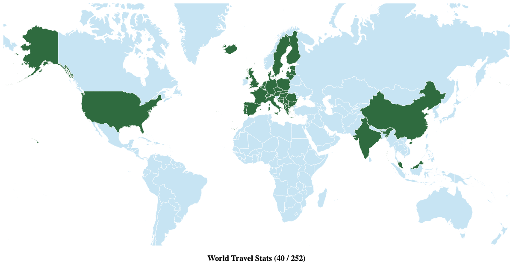
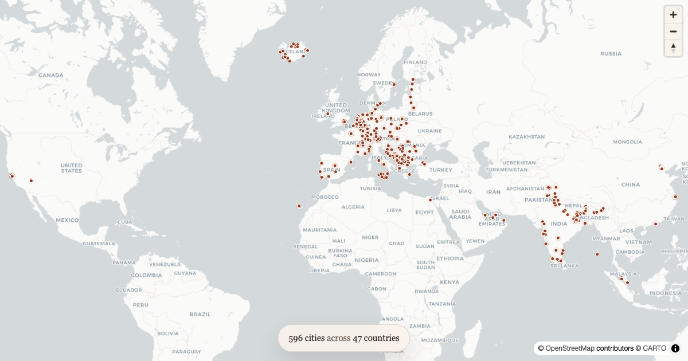
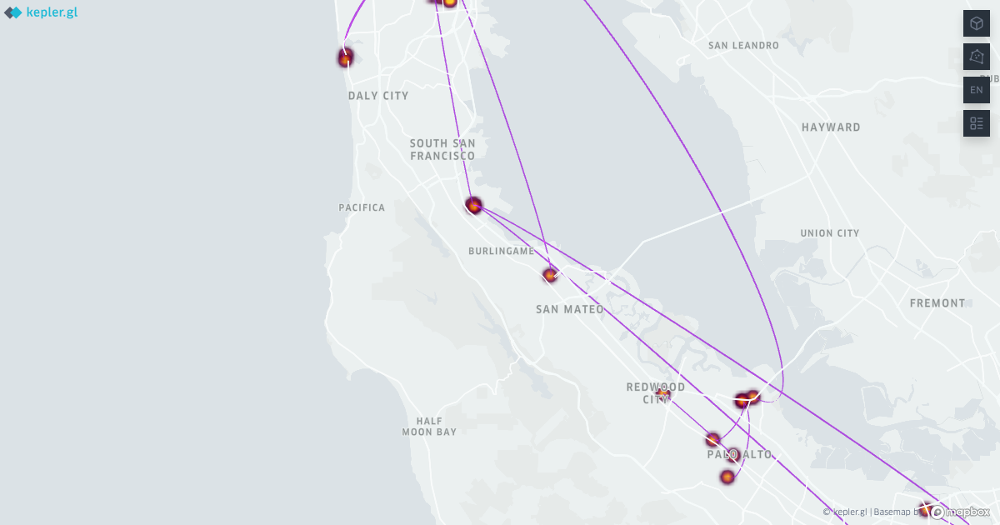
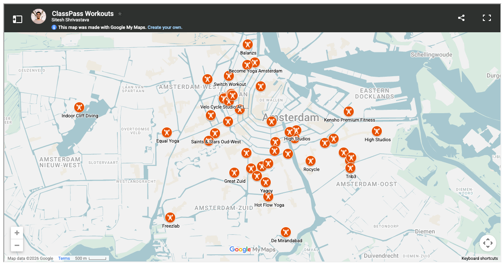
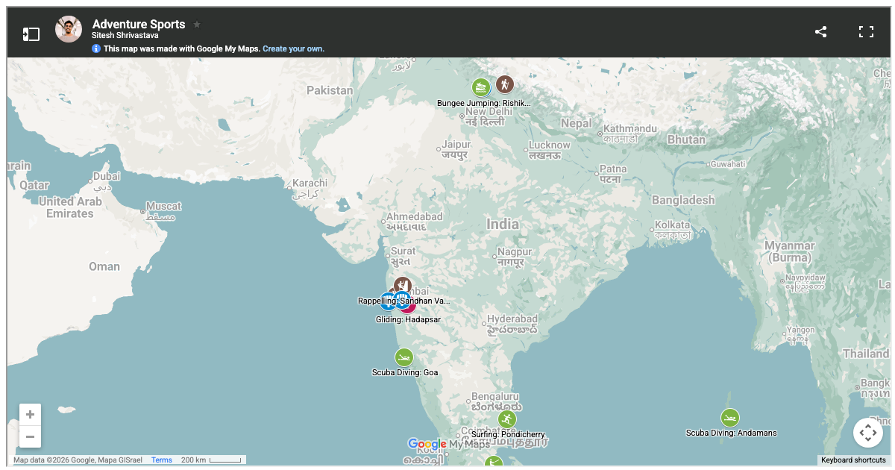
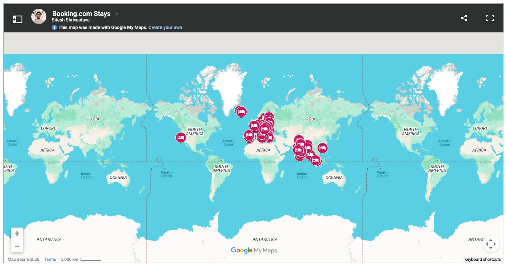
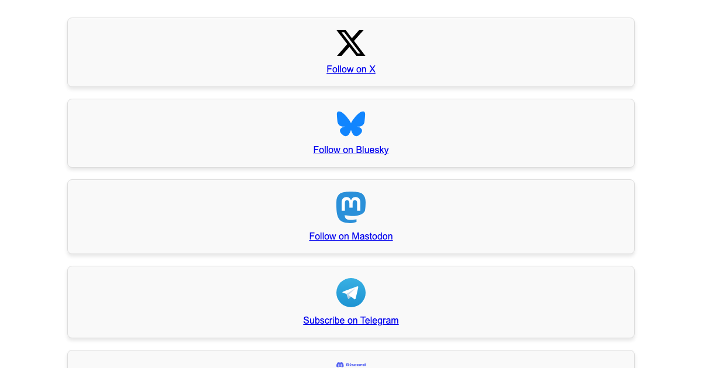
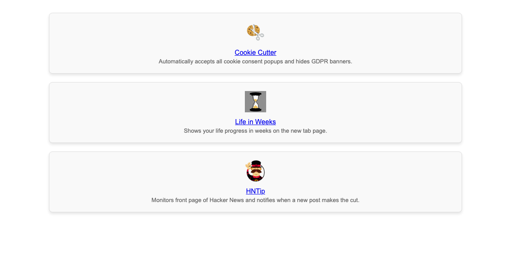
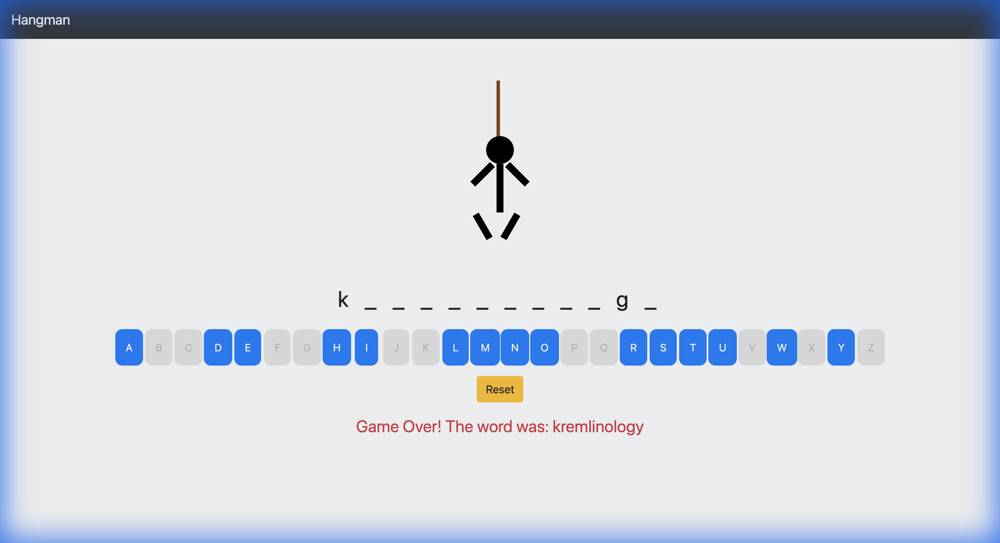

# [code.siteshshrivastava.com](https://code.siteshshrivastava.com)

Personal portfolio website showcasing code, projects, and interactive data visualizations.

## Travel visualizations

- [Countries](https://code.siteshshrivastava.com/countries.html) - Map of countries visited.

  

- [Cities](https://code.siteshshrivastava.com/cities.html) - Map of cities traveled.

  

- [Flights](https://code.siteshshrivastava.com/flights.html) - 3D flight route globe built from exported trip history.

  

- [Uber](https://code.siteshshrivastava.com/uber.html) - Kepler.gl map of ride history.

  

- [ClassPass](https://code.siteshshrivastava.com/classpass.html) - Map of workout locations.

  

- [Adventures](https://code.siteshshrivastava.com/adventures.html) - Map of adventure activity spots.

  

- [Booking.com stays](https://code.siteshshrivastava.com/booking.html) - Map of hotel stays.

  

## Other pages in this repo

- [Trend Bots](https://code.siteshshrivastava.com/trendbots.html) - Social links for the trend bot feeds and lists.

  

- [Chrome Extensions](https://code.siteshshrivastava.com/chromeextensions.html) - Published extensions and store links.

  

## Games

- [Hangman](https://code.siteshshrivastava.com/Hangman) - Classic word guessing game with animated graphics, linked from the homepage and served from a separate repository.

  

